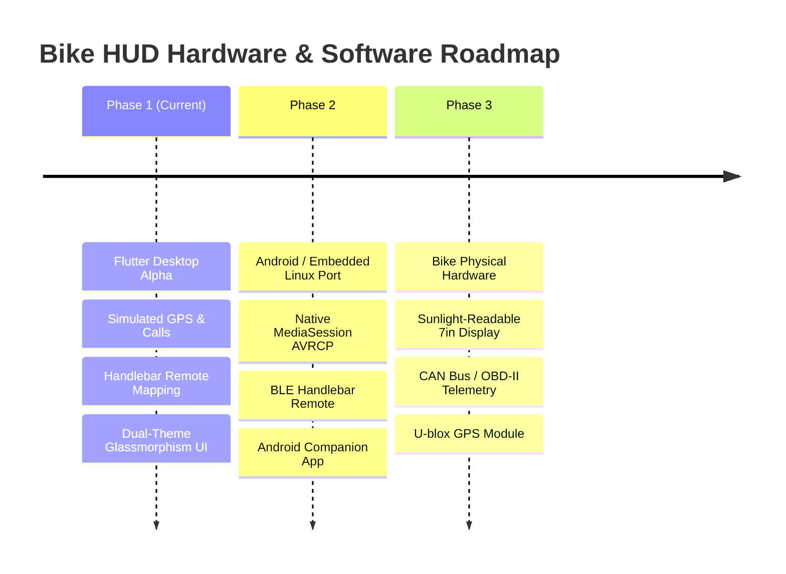

# Bike HUD — Application Design & Architecture Specification

A modern, high-contrast, automotive-grade Heads-Up Display (HUD) system designed for two-wheelers. Inspired by modern EV cockpits (Ather Stack, Android Auto, Apple CarPlay), Bike HUD prioritizes **glanceability, rider safety, zero road distraction, and hardware-control parity**.

---

## 1. System Overview & Vision

| Property | Specification |
| --- | --- |
| **Target Display** | 5.0" to 7.0" Landscape Touchscreen (1024 × 600 or 1280 × 720) |
| **Target Runtime** | Cross-platform Flutter (Windows Desktop for dev/simulation, Embedded Linux / Android for vehicle hardware) |
| **Input Modalities** | Dual-mode: Capacitive Glove-friendly Touch + 5-Way Handlebar Remote Switches |
| **Safety Standard** | Zero full-screen modal interruptions while riding; critical telemetry (speed, turn guidance) is never occluded |

---

## 2. Design System & Visual Language

### 2.1 Color Palette
The UI is engineered for high visibility under intense direct sunlight (Day Mode) and zero glare during night rides (Dark Mode).

#### Dark Theme (Default Night Mode)
- **Base Canvas (`bg`)**: `#0B0B0D` (Ultra-deep obsidian black to maximize OLED/mini-LED contrast and eliminate glare)
- **Primary Surface (`card`)**: `#161619` (Layered dark charcoal surface)
- **Elevated Surface (`card2`)**: `#202024` (Subtle elevated cards)
- **Divider & Borders (`line`)**: `rgba(255, 255, 255, 0.08)`
- **Track / Inactive Gauges (`track`)**: `rgba(255, 255, 255, 0.10)`
- **Primary Text (`text`)**: `#F5F5F3` (Soft off-white for reduced eye strain)
- **Secondary Text (`textDim`)**: `#8C8C93` (Sub-metrics and labels)
- **Tertiary Text (`textFaint`)**: `#5C5C62` (Static units, metric markers)
- **Accent Neon Emerald (`accent`)**: `#00E5A0` (High-visibility EV green for speedometer glow, active call indicators, and GPS lock)
- **Accent Ink (`accentInk`)**: `#003B26` (High contrast text on emerald backgrounds)
- **Warning / Alert**: `#FF5252` (Red for hangup, disconnection, speed warnings)

#### Light Theme (Daylight Sunlight Mode)
- **Base Canvas (`bg`)**: `#F4F4F6` (Cool crisp gray to cut glare)
- **Primary Surface (`card`)**: `#FFFFFF` (Clean white cards)
- **Elevated Surface (`card2`)**: `#EAECEF`
- **Primary Text (`text`)**: `#121214` (Deep charcoal black)
- **Secondary Text (`textDim`)**: `#5A5A64`
- **Accent Emerald (`accent`)**: `#00B37A` (High-contrast emerald for bright ambiances)

### 2.2 Typography
- **Primary Font**: `Space Grotesk` (Technical, geometric sans-serif engineered for high-legibility numerical dashboards)
- **Fallback / Secondary Font**: `Roboto` / System Sans-serif
- **Scale Hierarchy**:
  - **Speed Metric Hero**: `72px - 96px`, Bold, tight tracking
  - **Clock Display**: `26px`, SemiBold
  - **Card Headings**: `16px - 18px`, Bold
  - **Sub-metrics & Badges**: `11px - 13px`, Medium, `1.0 - 1.5px` letter spacing uppercase
  - **Captions & Metadata**: `11px`, Regular

### 2.3 Geometry & Elevation
- **Card Corner Radius**: `20px - 24px` for modern automotive aesthetic
- **Pill / Badge Corner Radius**: `14px - 16px` fully rounded capsules
- **Shadows**: Soft directional drop-shadows with colored ambient backglows (`#00E5A0` ambient glow on active gauges)

---

## 3. Screen & Layout Architecture

The app layout is built on a responsive, layered `Stack` inside a `SafeArea`:

```text
┌────────────────────────────────────────────────────────────────────────┐
│  Top Status Bar (Weather, Clock, Status Chips, Glanceable Mini Pills)  │
├────────────────────────────────────────────────────────────────────────┤
│                                                                        │
│   Dynamic Main Panel                                                   │
│   ┌───────────────────────────────────┬────────────────────────────┐   │
│   │                                   │                            │   │
│   │   Screen Content                  │   Contextual Music Card    │   │
│   │   (Dashboard / Navigation /       │   (Home Screen Only)       │   │
│   │    Documents / Settings)          │                            │   │
│   │                                   │                            │   │
│   └───────────────────────────────────┴────────────────────────────┘   │
│                                                                        │
│               [ Floating Bottom NavDock ]                              │
└────────────────────────────────────────────────────────────────────────┘
  ▲ [ Heads-Up Incoming Call Banner (Floats at Top: 10px during call) ]
```

### 3.1 Top Status Bar
- **Left**:
  - Weather summary (`18°`, sun icon)
  - When in home screen: weather description (`Clear · feels 16°`)
  - When outside home screen & music playing: **Mini Now-Playing Pill** with animated equalizer bars, track title, and tap-to-home shortcut
  - When call active: **Active Call Pill** with green live pulse dot, phone icon, caller name, live duration ticker (`mm:ss`), and red hang-up button (takes priority over music)
- **Center**: Large 24-hour digital clock (`14:32`)
- **Right**:
  - Phone connectivity chip (tap to deep-link directly into Connectivity Settings)
  - GPS fix status chip (green lock indicator)
  - Notification bell badge
  - Theme mode toggle button (Dark / Light)

### 3.2 Floating Bottom NavDock
Replaced traditional side drawers/hamburger menus with a centered, floating bottom dock for natural thumb reach on touchscreens:
- **Dashboard / Home (`H`)**: Speedometer, quick navigation glance, music card
- **Navigation (`N`)**: Full turn-by-turn map view, route presets, search
- **Documents (`D`)**: Digital vehicle credentials (RC, Insurance, License, PUC)
- **Settings (`S`)**: Connectivity, display, telemetry, developer tools

---

## 4. Screen-by-Screen Breakdown

### 4.1 Dashboard (Home Screen)
The rider's primary operational display.
- **Left Panel (3/4 Flex)**:
  - **Central Speedometer Arc**:
    - Semi-circular 0–180 km/h gauge with smooth neon gradient sweep.
    - Outer gauge markers: `0` and `180` positioned with dedicated offsets to eliminate visual overlap with the arc.
    - Large digital speed number with pulsating speed needle.
    - Sub-metrics footer: `TRIP` (km), `AVG SPEED` (km/h), `ODO` (km).
  - **Touchable Navigation Quick Card**:
    - Displays next turn direction icon, distance (e.g. `250 m`), and road name (`Koramangala 80ft Rd`).
    - **Interactive**: Tapping the navigation card immediately transitions to the full Navigation screen.
- **Right Panel (1/4 Flex)**:
  - **Music Card**: Exclusively visible on the Dashboard.
  - **Phone Connectivity Gating**:
    - **Disconnected State**: Shows phone icon with text *"Connect your phone to show Now Playing"* and an interactive **"Open Connectivity Settings"** button.
    - **Connected State**: Displays album artwork/vinyl icon, track title, artist name, live playback controls (Previous, Play/Pause, Next), volume slider, and animated equalizer bars.

### 4.2 Navigation Screen
- Full-screen turn-by-turn mapping interface.
- Turn card overlay (maneuver arrow, distance to turn, street name, next turn preview).
- Route metrics bar (ETA, remaining distance in km, remaining duration in minutes).
- **Glanceable Music**: When active, the Top Status Bar displays the compact Now Playing pill, allowing riders to monitor track playback without leaving navigation.

### 4.3 Documents Screen
- Digital glovebox providing one-tap access to roadside compliance documents:
  - Registration Certificate (RC) with plate number and chassis details
  - Vehicle Insurance Policy with expiration alert badge
  - Driving License (DL)
  - Pollution Under Control (PUC) certificate
- Zoom and full-screen view mode for presenting documents to traffic authorities.

### 4.4 Settings & Connectivity Screen
- Categorized settings panels:
  - **Connectivity Manager**:
    - Bluetooth Phone connection toggle & paired device list.
    - GPS module telemetry (satellite lock count, latitude/longitude, altitude).
  - **Display Preferences**: Dark / Light theme, brightness slider, auto-dimming.
  - **Handlebar Key Binding Reference**: In-app cheat sheet for remote controls.
  - **Simulator Controls**: Test controls for simulating incoming calls, GPS speed variation, and media sync.

---

## 5. Non-Intrusive Call UX System

Rider safety requires that incoming and active calls never blind the rider to road hazards or navigation maneuvers.

```mermaid
stateDiagram-v2
    [*] --> Idle
    Idle --> IncomingCall: Event (C key / Phone Ring)
    note right of IncomingCall: Heads-Up Banner at Top (10px)\nSpeedometer & Nav remain visible
    IncomingCall --> Idle: Reject / Esc Key / Touch Decline
    IncomingCall --> ActiveCall: Accept / Enter Key / Touch Answer
    note right of ActiveCall: Heads-Up Banner disappears\nActive Call Pill in Top Bar with mm:ss ticker
    ActiveCall --> Idle: Hang Up / Esc Key / Red Button
```

### 5.1 Heads-Up Incoming Call Banner
- Floats at the very top (`top: 10px`, `height: 62px`) with a frosted dark glass background and neon emerald pulsing border.
- Displays caller avatar/icon, caller name (`Praneeth`), and phone number.
- Action Buttons:
  - Red **Decline** button (`Esc` key)
  - Green **Answer** button (`Enter` key)
- Speedometer, turn arrows, and road metrics remain 100% visible and interactive.

### 5.2 Active Call Pill in Top Status Bar
- Once answered, the floating banner dismisses.
- An **Active Call Pill** renders on the left section of the Top Status Bar:
  - Pulsing green status dot
  - Phone call icon
  - Caller name (flexible with auto-ellipsis)
  - Live ticking duration timer (`mm:ss`)
  - Red circular **End Call** button
- Automatically takes priority over the mini music widget; upon call termination, the music widget restores seamlessly.

---

## 6. Input Modalities & Handlebar Remote Mapping

The app operates seamlessly using physical handlebar switches (mapped to keyboard inputs on PC desktop):

| Handlebar Remote Action | Keyboard Shortcut | Function |
| --- | --- | --- |
| **Media Play / Pause** | `Spacebar` | Toggle music playback |
| **Media Previous** | `Left Arrow` | Previous track |
| **Media Next** | `Right Arrow` | Next track |
| **Volume Up** | `Up Arrow` | Increase audio volume |
| **Volume Down** | `Down Arrow` | Decrease audio volume |
| **Call Answer** | `Enter` | Accept incoming call |
| **Call Decline / End** | `Escape` | Decline incoming call or hang up active call |
| **Simulate Call** | `C` | Trigger simulated incoming call |
| **Go to Home** | `H` | Open Dashboard / Home screen |
| **Go to Navigation** | `N` | Open Navigation screen |
| **Go to Documents** | `D` | Open Documents screen |
| **Go to Settings** | `S` | Open Settings screen |

---

## 7. Software Architecture & Code Organization

```text
lib/
 ├─ main.dart                        # App entry point, MaterialApp, dark/light theme config
 ├─ models/
 │   ├─ call_state.dart              # Call status, caller info, duration ticker (mm:ss)
 │   ├─ hud_app_state.dart           # Unified immutable state container with copyWith
 │   ├─ hud_screen.dart              # Enum (dashboard, navigation, documents, settings)
 │   ├─ hud_theme.dart               # Theme system (dark & light color palettes, shadows)
 │   ├─ music_state.dart             # Playback state, track metadata, volume
 │   └─ music_track.dart             # Title, artist, album, duration
 ├─ screens/
 │   └─ hud_home_screen.dart         # Root shell: layout Stack, timers, handlebar listener
 ├─ services/
 │   ├─ bluetooth_service.dart       # Phone BT connectivity check
 │   ├─ call_simulator_service.dart  # Call state machine (simulate, accept, reject, end)
 │   ├─ gps_simulator_service.dart   # GPS speed and heading simulation stream
 │   ├─ handlebar_button_service.dart# Hardware/keyboard event to HandlebarAction mapper
 │   ├─ music_service.dart           # OS MediaSession & Bluetooth sync service
 │   └─ navigation_simulator_service.dart # Simulated turn-by-turn guidance feed
 └─ widgets/
     ├─ dashboard_panel.dart         # Speedometer arc gauge, trip metrics
     ├─ equalizer_bars.dart          # Animated audio equalizer bars
     ├─ hud_card.dart                # Reusable glassmorphic HUD container
     ├─ incoming_call_overlay.dart   # Heads-up floating call banner
     ├─ main_panel.dart              # Screen switcher (dashboard, nav, docs, settings)
     ├─ music_card.dart              # Interactive music card with phone gating
     ├─ nav_dock.dart                # Bottom floating navigation dock
     ├─ navigation_panel.dart        # Full navigation view
     ├─ settings_panel.dart          # Connectivity and telemetry settings
     └─ top_status_bar.dart          # Status bar with active call & mini music pills
```

---

## 8. Hardware Integration & Production Roadmap



1. **Phase 1: Flutter Desktop Alpha (Current)**
   - Complete UI layout, design handoff fidelity, simulated GPS, calls, music controls, and responsive sizing.
2. **Phase 2: Mobile Companion & OS Audio Sync**
   - Connect Flutter app to phone via BLE / Wi-Fi Direct or run on dedicated Android / Linux vehicle head unit.
   - Native `MediaSessionManager` and `NotificationListenerService` integration for real-time Spotify/Apple Music metadata.
3. **Phase 3: Hardware Deployment**
   - **Display**: 7" 1000-nit sunlight-readable IPS capacitive touch panel.
   - **Compute**: Raspberry Pi CM4 or Rockchip RK3588 embedded board running custom Linux/Android.
   - **Telemetry**: CAN Bus / UART interface reading live wheel speed, battery SOC, temperature, and lean angle.
   - **Controls**: Waterproof IP67 handlebar 5-way toggle switch communicating over BLE/GPIO.

